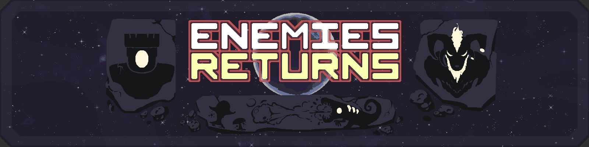
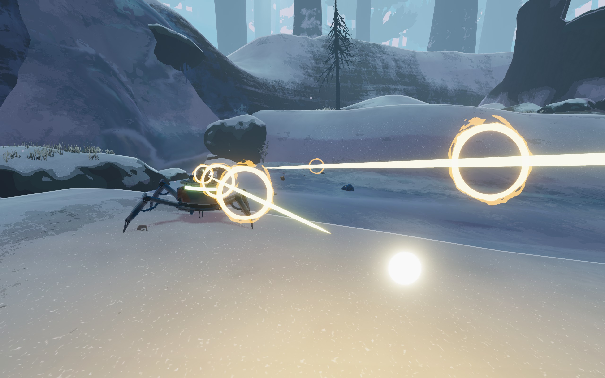
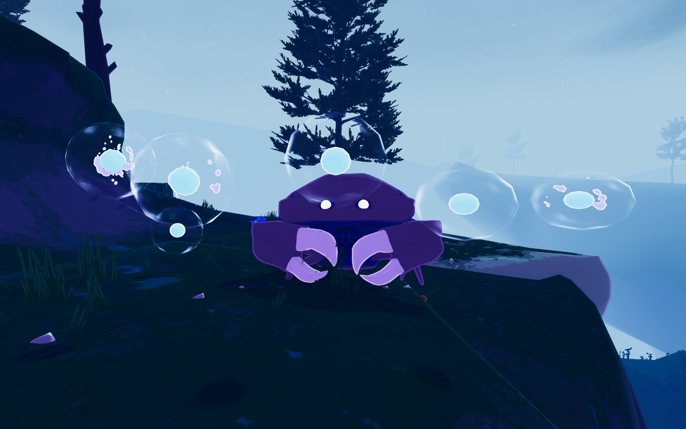
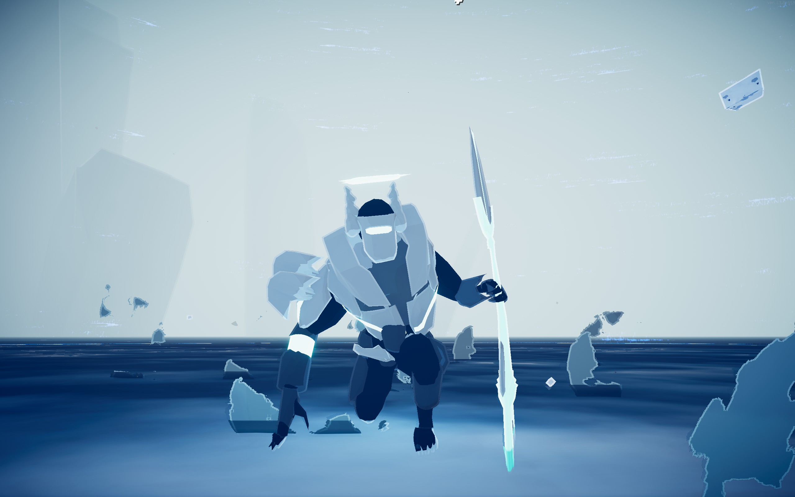
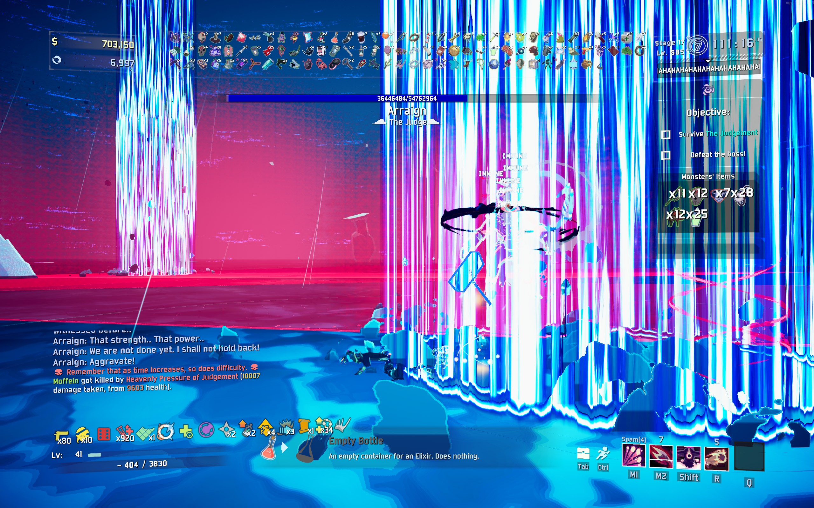

# Risk of Rain 2 - EnemiesReturns

My first experience with taking a pure Gameplay Designer role in a modding team. While I typically will handle both gameplay design as well as coding, this time I was solely responsible for design.

EnemiesReturns was created to address the lack of mods that add new enemies to the game, and adapts many enemies from the original Risk of Rain into Risk of Rain 2.

A pure passion project made by avid fans of the Risk of Rain franchise. **viliger**, **FORCED_REASSEMBLY**, **Sentinel**, **DestroyedClone**, and **TheTimesweeper**, I salute you!

[Thunderstore Link](https://thunderstore.io/c/riskofrain2/p/Risky_Sleeps/EnemiesReturns/)

## My Role

I was responsible for gameplay design, which involved planning out enemy gameplay and iterating over it based on in-game testing.

## Designing the Mod

When translating an enemy from the original Risk of Rain to Risk of Rain 2, there is no such thing as a direct port.

Most enemies in the original Risk of Rain are simple melee enemies, designed around overwhelming the player with sheer numbers. Even among the basegame enemies in Risk of Rain 2, none are exactly the same as they were in Risk of Rain 1. Lemurians and almost every enemy gains some form of a ranged attack. Stone Golems who simply were slow and tanky melee enemies in 1 gain a laser beam in 2.

With that in mind, the leading design goal behind EnemiesReturns was, "How do we adapt an enemy and keep its core identity recognizable, while also filling a gameplay niche that other enemies don't already fill?"

As a sample of some enemies I designed for this mod...

## Mechanical Spiders

These are one of the few ranged enemies in the original Risk of Rain. They spawn in droves, and shoot projectiles that players have to jump over.

However, in Risk of Rain 2, nearly every single enemy is an enemy that shoots a single projectile, so the leading question behind Mechanical Spiders was, "How do we do a fresh take on a low-tier projectile enemy?"

To address this, we focused on its attack pattern and movement.

For the attack pattern, we had it fire 2 projectiles in rapid succession. While simple, this is a shot pattern that isn't used by any enemy in the basegame. Firing 2 projectiles means that there is the potential to allow the enemy to have high damage if both shots hit, while being manageable to fight earlygame because the damage isn't frontloaded into a single projectile. Additionally, when multiple of these enemies spawn, the extra shots help create chaos by increasing the volume of projectiles present on the field.

On top of the attack, we gave Mechanical Spiders a short sideways dash that they can periodically use. We wanted them to lean into the role of a mobile harasser enemy, and also thought it felt fitting with their mechanical limbs.

## Sand Crabs

In the original Risk of Rain, these are simply a reskin of Stone Golems. The question when adding these to Risk of Rain 2, was how these could be differentiated from Stone Golems and Beetle Guards, the two earlygame miniboss enemies.

With Sand Crabs, we decided to aim for a niche that isn't covered by any other enemy in the game, and made them lean more towards a supportive role. While their health value is the same as Stone Golems and Beetle Guards, Sand Crabs will create slow and homing bubbles that can absorb player attacks.

While they lack the immediate offensive pressure that Golem Lasers have, they can do respectable damage if players chooses to ignore the bubbles. On top of this, bubbles provide cover for Sand Crabs to close in on players, allowing them to deal massive damage with their pincers if they get close.

## Arraign, the Secret Boss

The original [Starstorm](https://rainfusion.net/mod/df961f7c-f650-4b53-ada3-217c97f7119b/) mod for Risk of Rain 1 has Arraign, a secret superboss that can only be encountered late into a run after doing a series of obscure steps. He represents the final challenge a player will have in any given run, and is meant to be a threat no matter how powerful a player is.

The EnemiesReturns team decided to tackle Arraign because we wanted a similar kind of encouragement for lategame looped gameplay in Risk of Rain 2.

In the original Starstorm Mod, Arraign's defining feature is that he is immune to almost all damage, and can only be hurt by a player carrying Providence's dropped sword. This mechanic means that he is able to resist Risk of Rain's unpredictable exponential damage scaling, and forces the player to actively fight him at melee range.

In our adaptation of him, we wanted to preserve this mechanic while still allowing other players to contribute to the fight in multiplayer. To do so, we added health gates to Arraign; Players can damage him normally, but every 20% HP lost, he becomes immune to damage and a player carrying Mithrix's dropped hammer will need to whack him to shatter his defenses to allow the fight to progress.

A challenge while developing Arraign was figuring out his moveset. Like most enemies making the transition from 2D to 3D, we had a whole lot of extra factors that needed to be dealt with.
- How does Arraign, a sword user, deal with players who are airborne?
- What type of extra attacks will we need to add to keep him engaging as a boss?
- What standard should we use to balance how dodgeable his attacks are?

We brainstormed a lot of different attacks and moves he could do, but the initial result was that he simply felt like a collection of different attacks with a lack of a cohesive identity.

In response to this, I did a deep dive into Risk of Rain 2's final Boss, Mithrix, to quantify his attack loop worked. Mithrix sprints to a player, uses dashes and his Sprint Bash to stay in-range of a player, and his overhead Hammer Slam to kill players who are in his effective range. Mithrix is all about staying in-range of players, and his kit supports it.

With this knowlege, we looked at Arraign's moveset, and found that he lacked good gap closers and would often get locked into spamming ranged attacks, causing him to feel underwhelming. We solved this by trimming down the list of attacks Arraign has, and biasing his kit more towards dashes, leaps, and gap closers that let him get up close to players.

As a result, we managed to create one of the most intense bosses in Risk of Rain 2.

You can watch a run of his fight [here!](https://www.youtube.com/watch?v=Ku4EUAnEVd0)