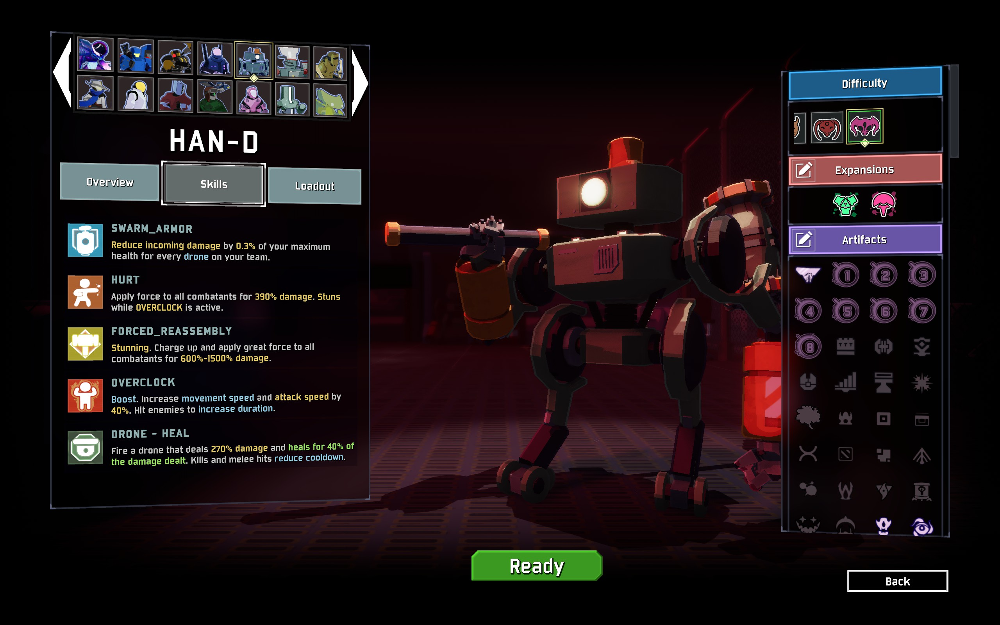
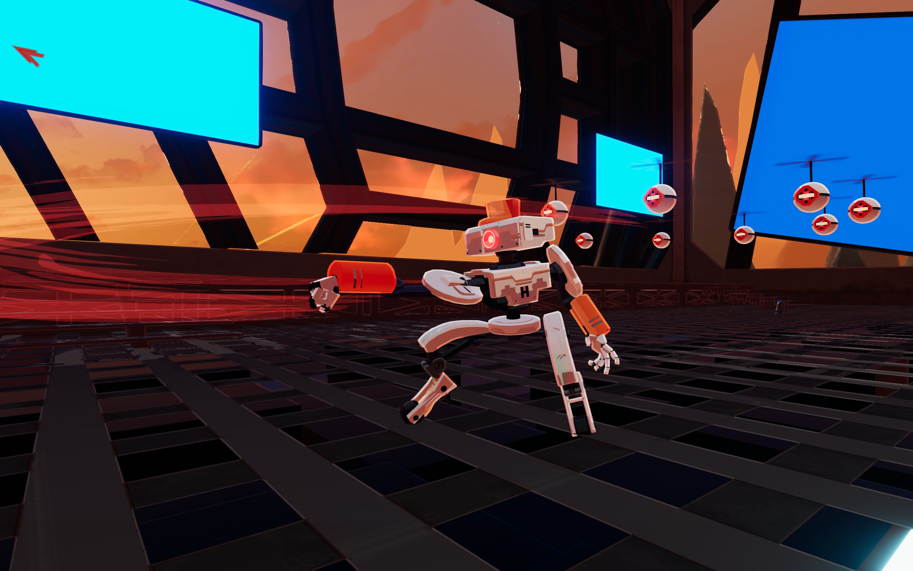
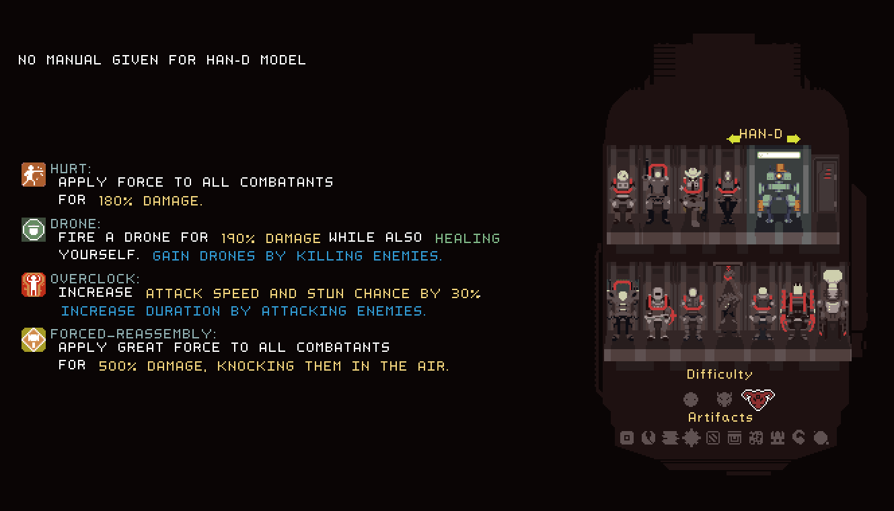
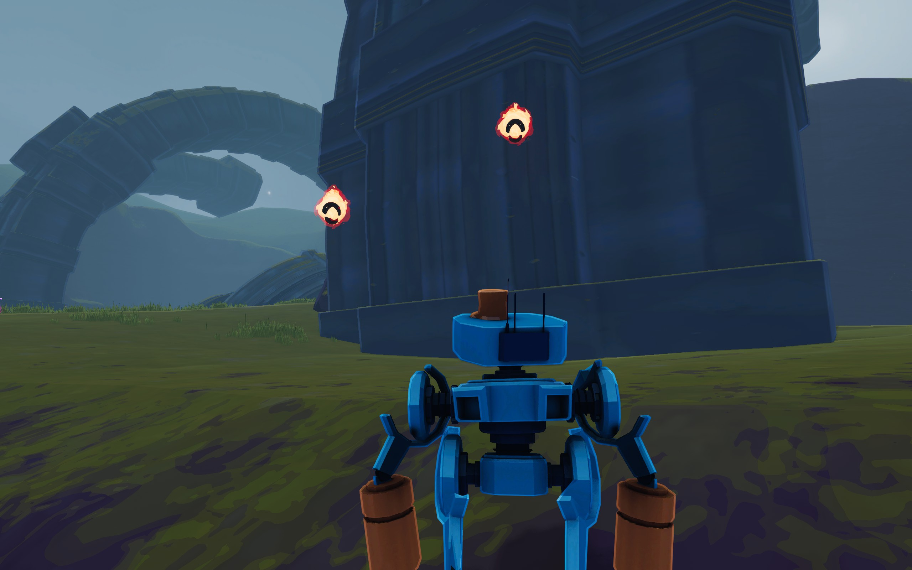
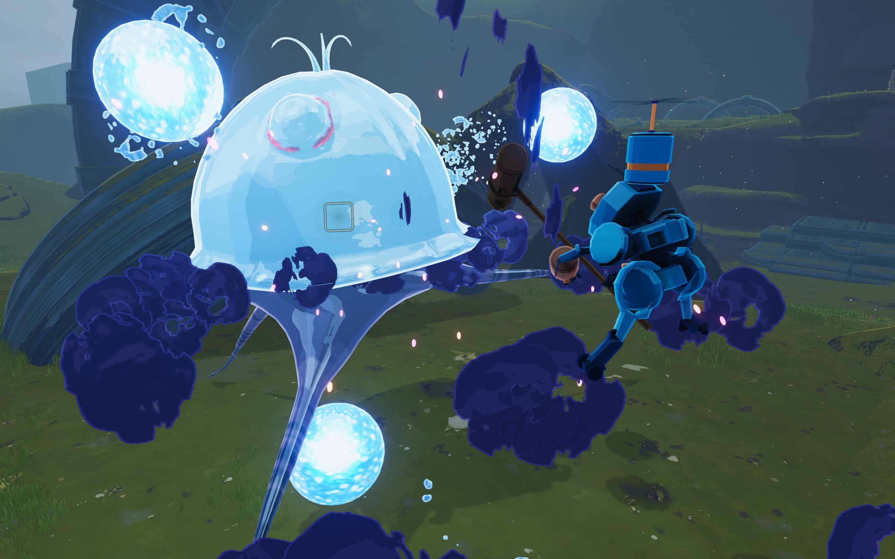
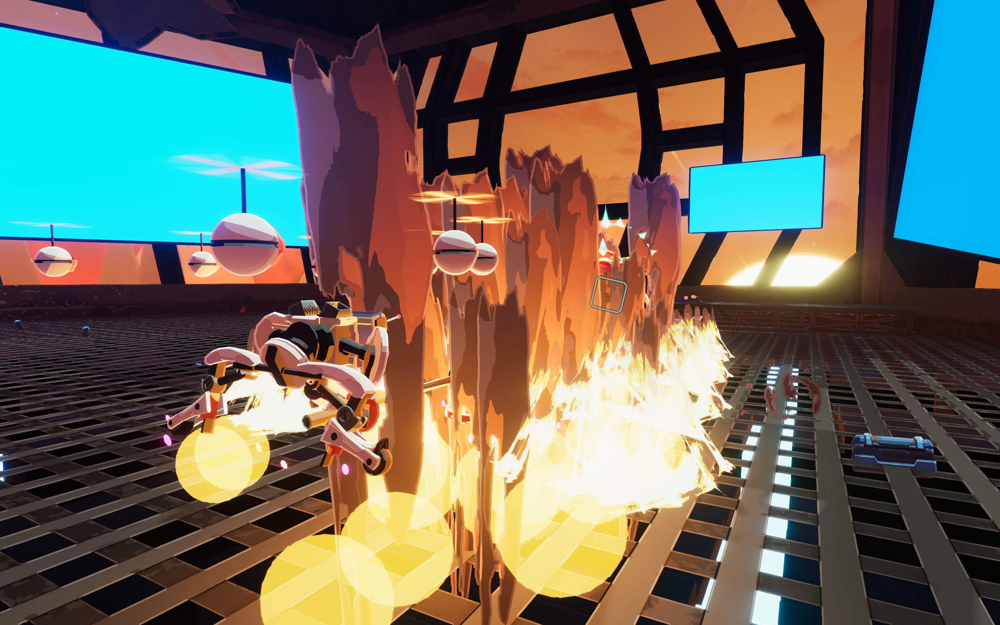

# Risk of Rain 2 - HAN-D

An adaptation of the survivor HAN-D from the original Risk of Rain. My personal favorite out of all the survivors I've created!

Shoutouts to **FORCED_REASSEMBLY** and **Pikmin88** for your invaluable feedback during development, you guys are the reason the mod is what it is!

[Thunderstore Link](https://thunderstore.io/c/riskofrain2/p/EnforcerGang/HAND_OVERCLOCKED/)

## My Role

I was responsible for gameplay design, as well as all gameplay code and networking for the mod.

## The History of HAN-D

In the original Risk of Rain, HAN-D is a melee tank survivor who is primarily known for repeatedly punching and smashing things.

hopoo originally experimented with HAN-D in early dev builds of RoR2, but abandoned it due to difficulties with making its kit work in 3D, and left behind a half-finished prototype in the files. As a result, there was always a cult following behind the survivor within the community, wishing he could get added to Risk of Rain 2.

## Figuring out HAN-D's Kit

Early-on in Risk of Rain 2's lifespan, I had experimented with touching up the prototype HAN-D into a workable state, but the biggest limiting factor was figuring out how to adapt HAN-D's kit in a way that would allow it to fight against flying enemies.

HAN-D's kit in the original Risk of Rain is:
- Primary: A simple melee attack.
- Secondary: Fire a drone to self-heal, recharges on-kill.
- Utility: Overclock, a self-buff that is maintained by repeatedly hitting enemies.
- Special: FORCED_REASSEMBLY, a strong melee attack. Not to be confused with the playtester who has the same name.

The initial HAN-D prototype from hopoo had FORCED_REASSEMBLY, the strong melee attack, placed in the Secondary slot, where you would press M1 for your standard attack, and M2 for your strong attack. This felt intuitive for Risk of Rain 2's 3rd Person Shooter gameplay, so I kept this.

This left 2 skill slots unaccounted for: The Utility and the Special skill.

I was of the opinion that Overclock was central to HAN-D's identity, while Drones could be swapped out. I tried many different combinations of skills during this time period, with the general gist of it being that the Utility was dedicated to being a vertical mobility skill, and Special would be for Overclock.

However, after tons of iteration, I came to the realization that the reason everything I tried felt wrong was because this was essentially turning into an original character that wasn't really HAN-D, and in retrospect, there was a noted decrease in enthusiasm among playtesters.

With that realization in mind, I decided to take a new approach.

## A New Approach

I gave a second pass over HAN-D's kit, opting to directly port the RoR1 kit, and seeing specifically where it was deficient.

As expected, HAN-D had serious trouble with fighting flying enemies. However, rather than trying to create entirely new skills, I looked at how I could add vertical mobility to existing skills.

Overclock was a skill that simply changed HAN-D's stats, so I added extra functionality to it. Activating Overclock would break HAN-D's fall, and I added an input to cancel it and gain an extra jump.

FORCED_REASSSEMBLY's animation is an overhead hammer swing, so I thought, "What if the force behind it was so great that it launches HAN-D upwards when he hits something with it?", and augmented it with a vertical hop when hitting enemies.

On top of this, I decided to treat FORCED_REASSEMBLY as a short-ranged ranged attack, rather than a true melee attack, stylized as creating a massive shockwave reaching far in front of HAN-D. While it functionally serves a similar role to a piercing shotgun blast, the shockwave stylization preserves the melee character fantasy, which is important for HAN-D's identity.

Rather than reinventing the wheel, working with HAN-D's existing kit and thinking of it in terms of how it could be made to work within a 3d space proved to be the winning strategy.

## Adding Depth

HAN-D's gameplay was feeling much better, but it felt a bit unsatisfying. HAN-D was a melee survivor who would simply go up to an enemy and hold down the attack buttons. There was a lack of a learning curve to the gameplay.

To address this, I looked at HAN-D's 2 melee attacks, HURT (Primary) and FORCED_REASSEMBLY (Secondary).

In the original Risk of Rain, FORCED_REASSEMBLY knocks enemies into the air, and HURT has high knockback, so you can repeatedly punch enemies against walls. In 3d, having high knockback on a melee character is counterproductive because levels don't have convenient walls you can infinitely stunlock enemies against, so you just knock enemies out-of-range instead.

I decided to adapt FORCED_REASSEMBLY's upwards knockback and HURT's knockback by turning them into a melee combo:
- FORCED_REASSEMBLY launches grounded enemies into the air.
- HURT then gainst increased knockback force against them.

By making HURT's knockback conditional, players get to choose when they want to knock enemies back, and when they want to keep them in-range to keep fighting them. This additional layer of complexity helped make HAN-D's gameplay feel much more dynamic, and has lead to many memorable moments in Multiplayer where a HAN-D would save the day by knocking a dangerous boss off a cliff.

