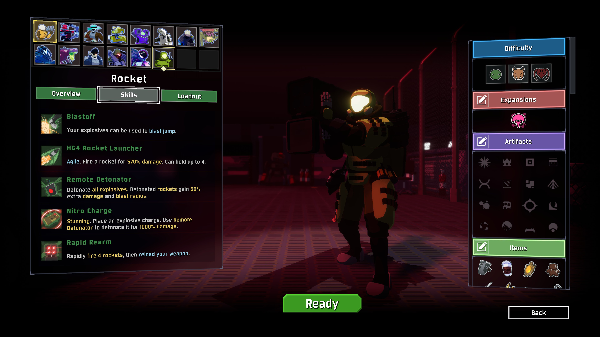
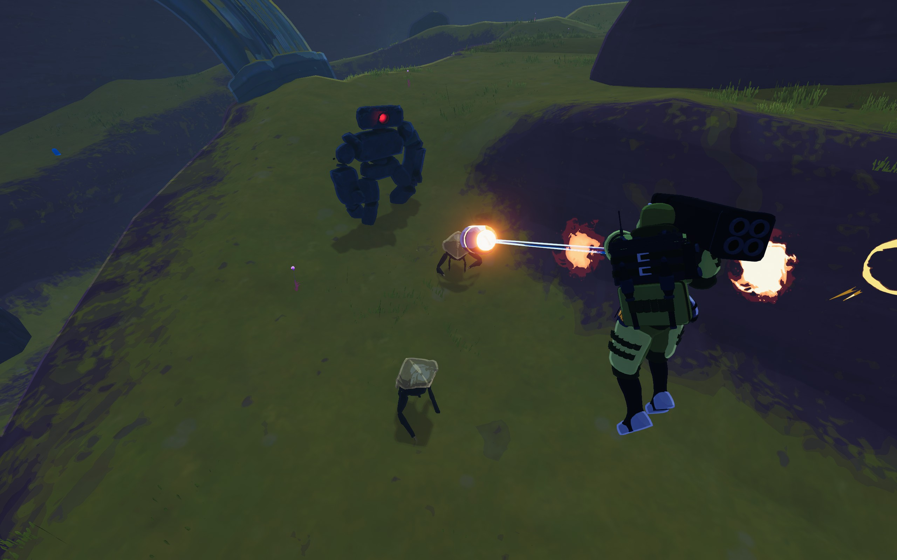
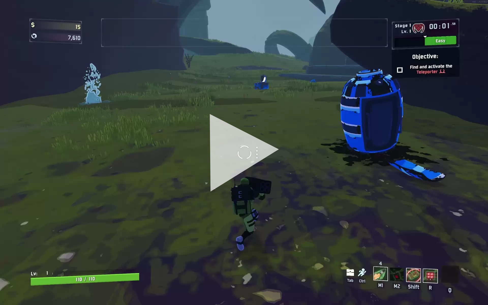

# Risk of Rain 2 - Rocket

My first fully-original survivor for Risk of Rain 2.
A character with a high skill ceiling who can use rocket jumps to speed around the map.

[Thunderstore Link](https://thunderstore.io/c/riskofrain2/p/EnforcerGang/Rocket/)

## My Role

I was responsible for gameplay design, as well as all gameplay code and networking for the mod.

## Designing Rocket's Kit

### Primary: HG4 Rocket Laucher

I am an avid Soldier player in Team Fortress 2, and I wanted to be able to capture the feeling of chaining Rocket Jumps around a map like in that game.
Additionally, at a time when Risk of Rain 2 survivors were leaning more towards being 'special superheroes with unique lore',  I wanted to create a Risk of Rain character that leaned more towards being an expendable military grunt character, like the survivors were in the original Risk of Rain.

From that desire, I drafted a survivor kit to accommodate this.
Rocket's primary skill mirrors Soldier's Rocket Launcher, having the same ammo capacity and function times, as well as being usable for Rocket Jumping.
While few Risk of Rain characters have limited stocks on their primary, it was decided that Rocket needed it due to being a character that had strong AoE on his primary attack.

### Secondary: Remote Detonator

Being a character with a projectile-based primary, Rocket had trouble fighting small airborne enemies due to their small hitboxes, and the travel time of his projectiles. To cover that gap, I looked towards DOOM 2016 as inspiration, and made his Secondary skill able to detonate rockets midair.
An unintended side effect of this skill was that players could shoot a rocket behind them midair and immediately detonate it to greatly boost their speed, which ended up becoming a beloved tech that players could use.

### Special: Rapid Rearm

Rocket's Special skill came in response to his ammo limitation on his primary. It simply allows him to fire a barrage of rockets and instantly reset his primary ammo, on a long cooldown. The rocket barrage can be used to deal damage, but is also an invaluable tool when chaining Rocket Jumps together, as it allows you to continue your jump chain when your Primary needs to reload.

### Utility: Nitro Charge

Rocket's Utility skill went through the most iteration. Initially, it was an impact-detonated Concussion Grenade that would knock enemies into the air. Early in Rocket's development, all his attacks had very high knockback, and the idea was that the Concussion Grenade could be combined with other skills to stall and juggle enemies in the air. While this was fun to playtest on my own, it was very gimmicky in practice, and less-skilled players who could not hit those airshots found the skill to be useless. On top of this, Rocket's high attack knockback was disruptive for other players, as enemies would be knocked away from their attacks.

With this in mind, I iterated on the skill. I reduced Rocket's overall attack knockback to be significantly lower to prevent him from disrupting other players. I realized that Rocket's Secondary Remote Detonator was pretty much only tied to the rocket projectiles from his Primary and Special attacks, so I decided to make the skill add another projectile that interacts with it. Nitro Charge, a remote-detonated C4 with increased knockback power was born from this need, and ended up becoming a favorite among players both due to its strong damage, as well as how it interacted with Rocket's movement, being able to set up complex Rocket Jump chains using it.

## Creating the Perfect Rocket Jump

### Momentum Conservation

There's a lot of games that include an option to Rocket Jump. Shoot a rocket at your own feet, knock yourself back.
However, what separates mediocre Rocket Jumps from good Rocket Jumps is momentum conservation.

Risk of Rain 2 has self-knockback skills in the basegame, like REX's Sonic Boom and Railgunner's Concussion Mines. However, these do not conserve momentum due to the game's physics.
In Risk of Rain 2, midair players will always decelerate to their base movement speed over time, which means that self-knockback skills will only knock a player back a certain amount, before the player regains full control over their movement midair and loses their extra momentum.

Because of this, I wrote custom movement handling code for Rocket while he Rocket Jumps.
Unlike other characters, who will decelerate to base movement speed while midair, Rocket will maintain his speed if he inputs in the direction of his Rocket Jump trajectory, with some tolerance to allow for gradual turning while midaiar.

### Rocket Jump Feel

After solving the momentum conservation problem, the next issue that became immediately noticeable was the accuracy of Rocket Jumps.

When playing a First Person Shooter, your rockets typically come directly from the center of your screen or very close to it, and there is a very tight and predictable timing on when they will hit the ground and detonate.

Howver, in Risk of Rain 2, the camera position is very far from the character, and projectiles typically spawn above far above players. Additionally, Risk of Rain 2 characters move very fast, sprinting at 10m/s right off the bat. With these 2 factors combined, it becomes very hard to judge where your rocket is truly aimed at in relation to your foot position. An early frustration with playing Rocket would be that you could have perfect form in executing a rocket jump, but you'd stall and fail to gain speed.

With this in mind, I did a lot of experimentation, and was able to get complex Rocket Jumps to feel good with the following changes:
- Rocket blasts apply consistent knockback force regardless of how far you are from the blast center.
- Rocket Jumps bias knockback force horizontally to help with combo jumps.
- Rocket Jumps always stop your own downwards momentum, and are guaranteed to provide some amount of upwards force.

### The End Result?

## Networking Rocket Jumps

Projectile-based attacks in Risk of Rain 2 suffer from latency over the network. Projectiles run entirely server-side, and as a result will often be very delayed for clients. Since Rocket's Rocket Jumps rely on server-side projectiles, they were very noticealby inconsistent for clients, often resulting in unpredictable trajectories and timing.

To remedy this, I made some changes to how Rocket's projectiles are handled.

### More-Accurate Rocket Jumps for Network Clients

Initially, Rocket's Rocket Jumps calculated blast force like other blast attacks, by juding the blast position and the position of the player on the server. However, movement in Risk of Rain 2 is client-authoritative. As a result, this desync caused Rocket Jump trajectories to be wildly inaccurate for online clients.

To remedy this, I reworked the Rocket Jump code to calculate Rocket Jump physics client-side; The server would report when and where the projectile detonated, and the client would use that information to create a more-sensible Rocket Jump path.

### Reducing Rocket Jump Delay for Network Clients

The second part of the online Rocket Jumping problem was that rocket projectiles would be very delayed, causing complex jumps to be impossible online due to the timing differences.

I managed to solve this by taking advantage of Risk of Rain 2's client-side projectile prediction visuals. While actual projectile logic runs on the server, the client will simulate simple projectiles. I took advantage of this by making Rocket's simple Primary rockets run their Rocket Jump logic on the predicted client-side projectiles, which allowed online clients to do a lot of complex jumps with very little delay.