# Risk of Rain 2 - Sniper Classic

An adaptation of the Sniper survivor from the original Risk of Rain, and my first fully-standalone playable character that I created.

A character who charges up powerful Sniper shots, and deals devastating AoE damage.

[Thunderstore Link](https://thunderstore.io/c/riskofrain2/p/EnforcerGang/SniperClassic/)

[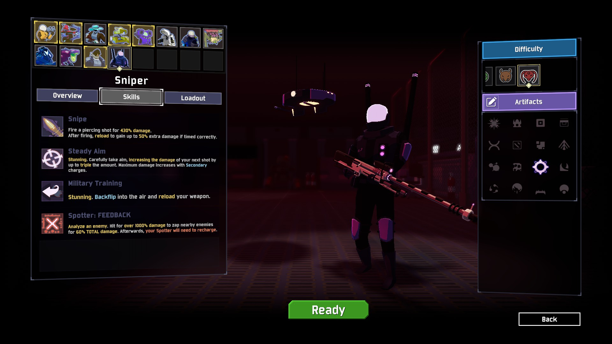]()
[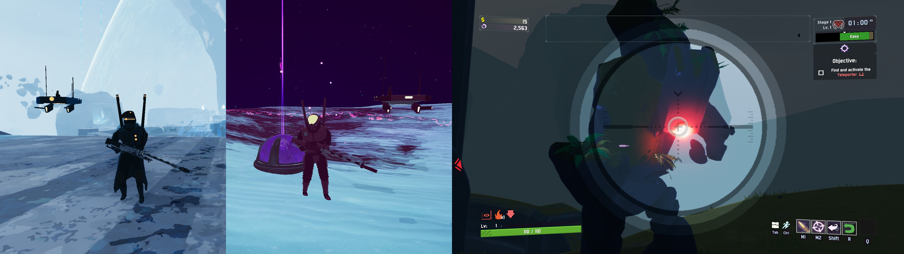]()
[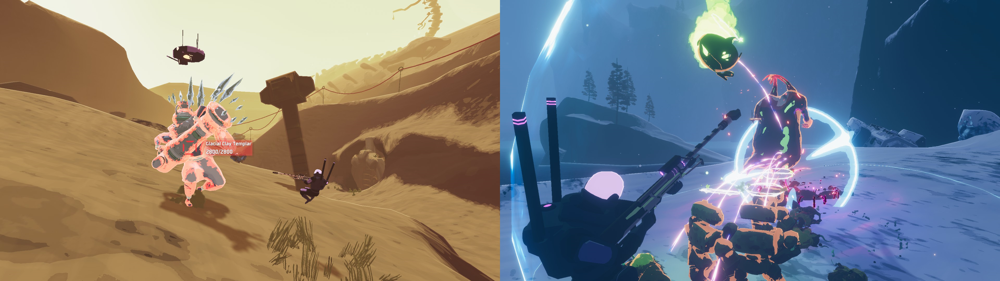]()

## My Role

I was responsible for gameplay design, as well as all gameplay code and networking for the mod.

## The Initial Pitch

Sniper is my favorite character from the original Risk of Rain.

Prior to the release of Railgunner with the official Survivors of the Void DLC, Risk of Rain 2 lacked a true dedicated long-range precision character, so I wanted to fill that niche.

[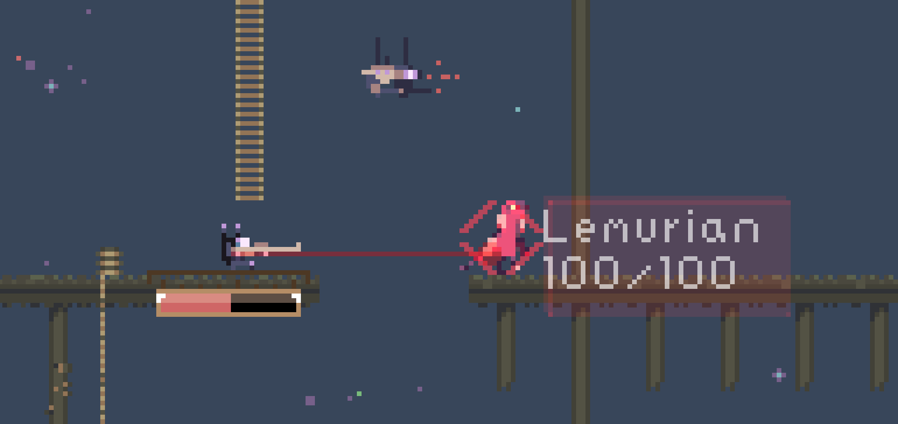]()

While there had been prior attempts to translate the character from the original Risk of Rain's 2D platformer gameplay into Risk of Rain 2's 3rd Person Shooter gameplay, they didn't quite feel right, as the shift from 2D to 3D turned Sniper from being a crowd-clearing character who could shoot through lines of enemies, into a single-target character who had to individually aim at each enemy.

## Understanding the Original Kit

Sniper's original kit from Risk of Rain 1 is as follows:
- Primary: Fires a single sniper shot, with a reload minigame in-between shots.
- Secondary: Charges up a piercing shot that can clear waves of enemies on a platform.
- Utility: Backflips away from enemies, to create space to charge up shots.
- Special: Targets an enemy with a Spotter Drone, to make them vulnerable to Critical Strikes.

[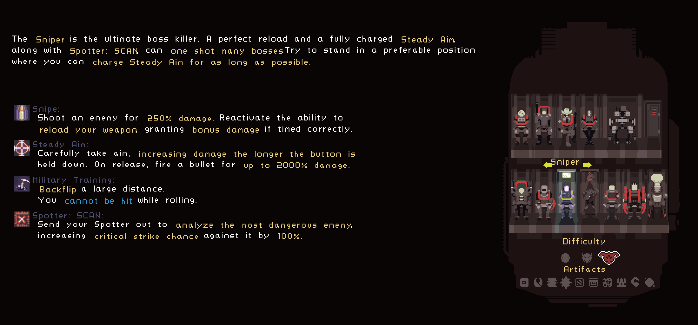]()

It's a deceptively simple kit: Shoot a bullet for your basic attack. Charge up strong shots, mark an enemy to make your strong shots stronger.
But when it is translated 1:1 to 3D, it becomes apparent in-game that it feels very different from how the character plays in 2D.

With this in mind, I played many runs with Sniper in the original Risk of Rain to figure out the character, and came up with these core takeaways about their identity:
- Sniper is about wiping out crowds with a single strong attack.
- Sniper's gameplay rhythm is about taking risks to charge up a powerful shot, then escaping in the nick of time once you fire your shot.

## Adapting the Kit

When adapting Sniper to 3D, the first thing that became immediately apparent is that a piercing shot did not have the same crowd control potential that it had in 2D.

In the original 2D game, enemies will only come from in front of you or behind you. As a result, a piercing shot is extremely powerful and can clear one side of the screen.

[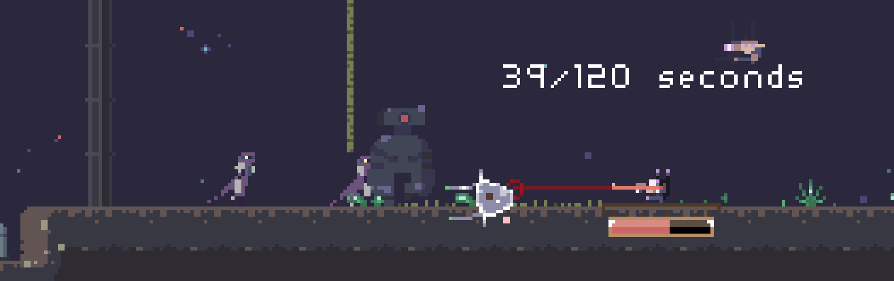]()

However in 3D, enemies can come at you from 360 degrees. A piercing shot only covers a small fraction of the playable space.

[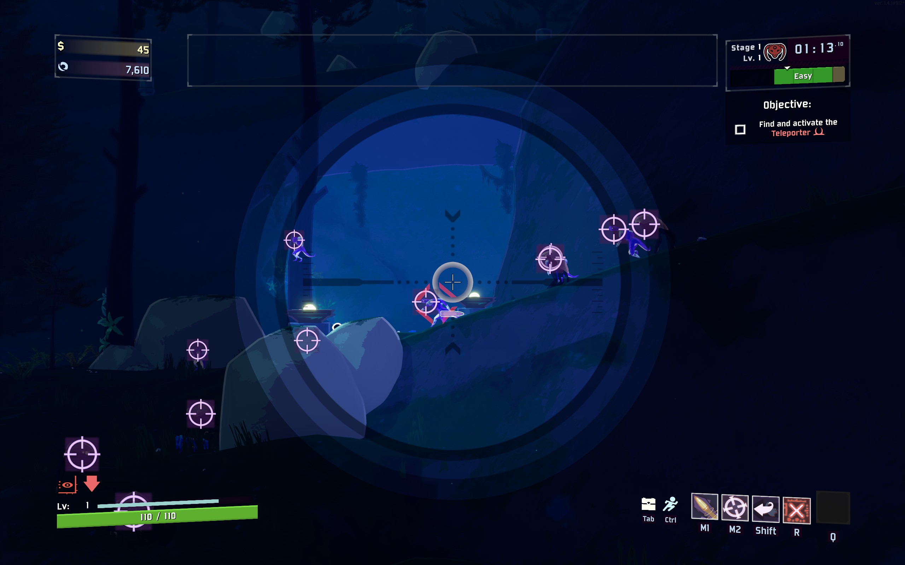]()

To solve this issue, I looked towards Sniper's Special skill, the Spotter Drone.

[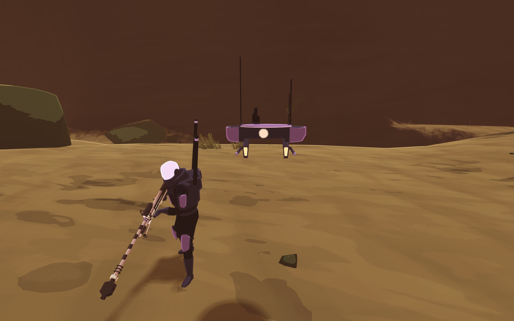]()

In the original Risk of Rain, it simply acts as a damage amplifier: You spot an enemy, they take more damage.
While there are a few quirks with how the damage amplification works, it pretty much is just a "set it and forget it" thing that boosts the numbers on whatever attacks your Primary and Secondary are putting out.

When adapting Sniper into Risk of Rain 2, I wanted to add more to this skill, so that it would feel like a full-fledged attack with its own learning curve for using it, and I also wanted to see if it could be used to fill in that missings AoE gap in Sniper's kit.

The solution I came up with for Sniper's 3D AOE problems was to make the Spotter Drone act as an AoE attack.

First, you target an enemy with it...

[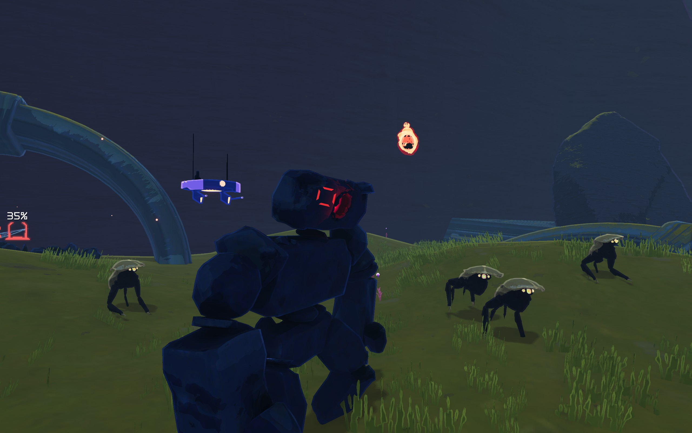]()

Then you shoot the enemy, and a portion of the damage is transferred to all other enemies near them!

[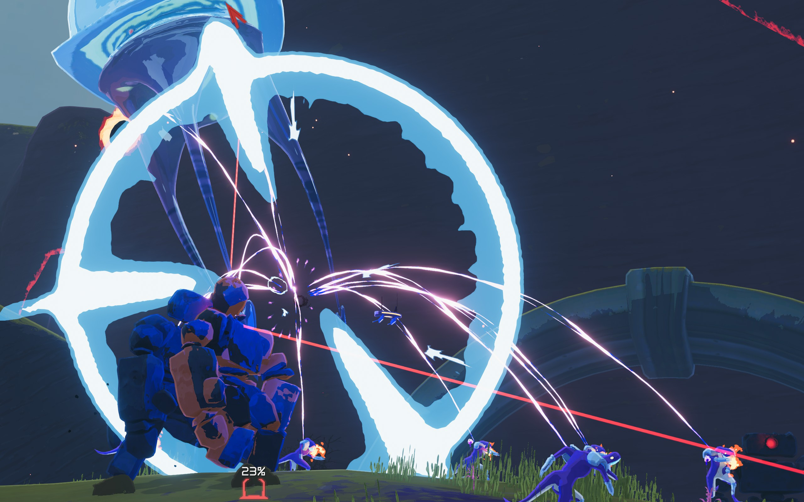]()

With this, I was able to preserve the core feeling of playing Sniper in Risk of Rain 1 while still keeping the kit familiar to people coming from the first game.

This ended up creating a very different gameplay experience from the official Railgunner survivor, who entirely specializes in single-target damage, so the mod has aged well and still remains a unique experience even today.

[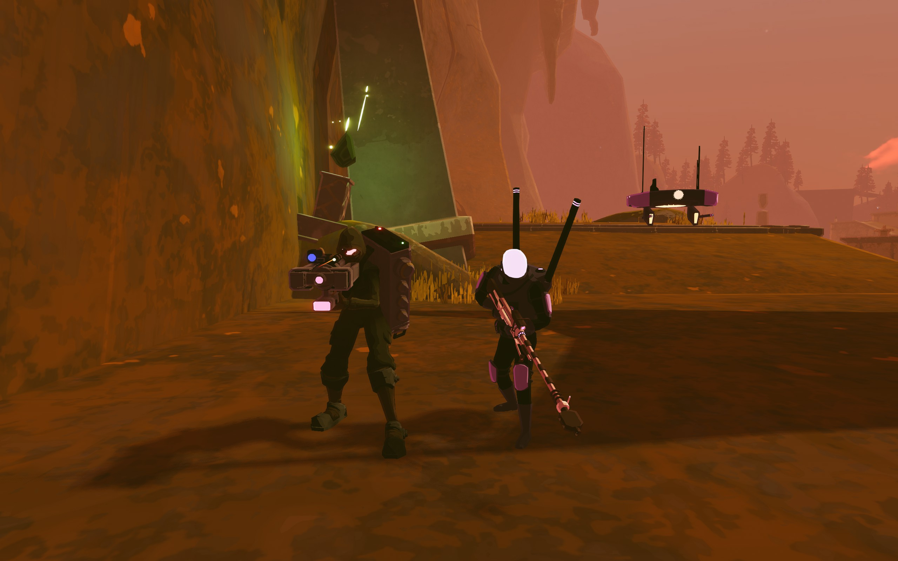]()